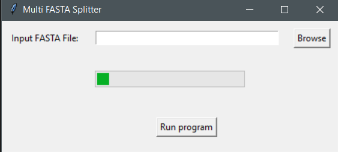

# Multi-FASTA-Splitter

A lightweight fast windows gui app that splits a multi fasta file to individual single fasta files  

## Citations

1. Shen, W., Sipos, B., & Zhao, L. (2024). SeqKit2: A Swiss army knife for sequence and alignment processing. iMeta, 3(3), e191. doi: [10.1002/imt2.191](https://doi.org/10.1002/imt2.191)
2. Tsiouri Olga. Multi FASTA Splitter: A lightweight fast windows gui app that splits a multi fasta file to individual single fasta files.[https://github.com/BioGUIwsl1Lab/Multi-FASTA-Splitter](https://github.com/BioGUIwsl1Lab/Multi-FASTA-Splitter)

## Dependencies

1. Windows 11 or 10 version 16215.0 or higher(type `winver` on the search button and click `winver` to find your OS version)
2. [Windows Subsystem for linux(wsl1)](INSTALL.md)
3. the file in the `bin` folder

## Usage 

Click on the `FASTA Small Seq Collector.exe` file

Click `browse` and select an input file

Click `Run program`

The example input/output files can be seen on the `data` folder

As seen in the folder the program creates an output folder to store the single-FASTA files

Input file for was downloaded from solgenomics.net tomato annotation version 4.1.
